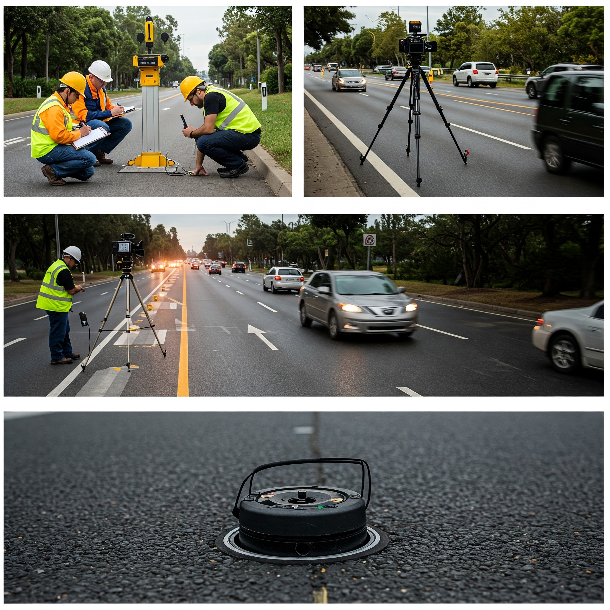

# **教学案例主题一：城市路口交通流量调查与分析**

## **1. 教学设计**

- 教学目标：
  - 理解交通调查的目的和意义。
  - 掌握不同交通调查方法的原理和应用。
  - 能够设计和实施交通流量调查方案。
  - 能够分析交通流量数据，识别交通问题。
- 教学内容：
  - 交通调查概述（目的、类型、意义）。
  - 交通流量调查方法（人工计数、视频检测、感应线圈等）。
  - 交通流量数据分析（流量、高峰小时系数、服务水平等）。
  - 案例分析：某城市路口交通流量调查与分析。
- 教学活动安排：
  - 互动环节一：调查方法选择（10分钟）
    - 教师提出问题：针对不同交通场景，如何选择合适的调查方法？
    - 学生分组讨论，分析各种调查方法的优缺点。
    - 各组代表分享讨论结果，教师引导总结。
  - 互动环节二：调查方案设计（20分钟）
    - 教师提供某城市路口的地图和相关信息。
    - 学生分组设计交通流量调查方案，包括调查时间、地点、方法、人员、设备等。
    - 各组代表展示方案，并接受其他学生的提问和评价。
  - 互动环节三：数据分析与问题识别（30分钟）
    - 教师提供模拟的交通流量调查数据。
    - 学生分组分析数据，计算相关指标，绘制图表。
    - 学生根据分析结果，识别路口的交通问题，并提出改进建议。
    - 各组代表分享分析结果和建议，教师点评。
- 时间分配：
  - 导入（5分钟）
  - 理论讲解（20分钟）
  - 案例分析（20分钟）
  - 调查方案设计与数据分析（30分钟）
  - 总结与评价（5分钟）
- 预期成果：
  - 学生能够理解交通调查的目的和意义。
  - 学生能够掌握不同交通调查方法的原理和应用。
  - 学生能够设计和实施交通流量调查方案。
  - 学生能够分析交通流量数据，识别交通问题。

## **2. 多媒体教学资源**

### 2.1 图片

不同交通调查方法的现场照片（人工计数、视频检测、感应线圈等）

### 2.2 ppt

[交通调查](ppt/第3章交通调查.ppt)

### 2.3 视频

## **3. 练习题**

### **3.1 选择题**

1. **人工计数法的优点是：**
   - A. 成本低，操作简单
   - B. 可以获取详细的车辆类型和行驶轨迹信息
   - C. 适用于大规模、长时间的交通流量调查
   - D. 数据精度高，受人为因素影响小
2. **高峰小时系数（PHF）的计算公式是：**
   - A. 高峰小时流量 / 小时内最大15分钟流量
   - B. 小时内最大15分钟流量 / 高峰小时流量
   - C. 高峰小时流量 / 小时内平均流量
   - D. 小时内平均流量 / 高峰小时流量
3. **以下哪种交通调查方法适用于获取车辆速度分布数据？**
   - A. 人工计数法
   - B. 视频检测法
   - C. 感应线圈法
   - D. 雷达测速法

**选择题答案与解析：**

1. **人工计数法的优点是：**

   - **A. 成本低，操作简单**
   - **解析：** 人工计数法相较于其他技术手段，成本较低且易于操作，但可能受人为因素影响较大。

2. **高峰小时系数（PHF）的计算公式是：**

   - **A. 高峰小时流量 / 小时内最大15分钟流量**
   - **解析：** 高峰小时系数用于反映高峰小时内流量的不均匀程度，计算公式为高峰小时流量除以小时内最大15分钟流量。

3. **以下哪种交通调查方法适用于获取车辆速度分布数据？**

   - **D. 雷达测速法**
   - **解析：** 雷达测速法能够精确测量车辆速度，适用于获取车辆速度分布数据。视频检测法和感应线圈法也可以获取速度信息。

   

### 3.2 填空题

1. **交通调查的主要目的是为了________、________和________交通状况，识别存在的问题并为交通管理提供决策支持。**
2. **常见的交通流量调查方法包括________、________和________等，每种方法适用于不同的交通场景。**
3. **在设计交通流量调查方案时，需考虑的关键因素包括________、________、________和________等。**
4. **高峰小时系数用于衡量交通流量的________，是交通数据分析中的重要指标之一。**
5. **在分析交通流量数据时，识别交通问题通常需要结合________和________等分析方法，发现拥堵、瓶颈等现象。**

------

1. **答案：** 收集、分析、评估
    **解析：** 交通调查的目的是通过系统地收集和分析交通数据，评估交通状况，识别问题，为交通规划和管理提供科学依据。
2. **答案：** 人工计数、视频检测、感应线圈
    **解析：** 不同的交通流量调查方法各有优缺点：人工计数成本低但易受人为因素影响；视频检测可自动记录但设备成本较高；感应线圈适用于高速公路等固定场所。
3. **答案：** 调查时间、地点、方法、人员
    **解析：** 设计调查方案时，需要明确调查的具体时间段、地点选择、使用的方法（如人工或视频）、参与人员及其分工，以确保调查结果的有效性和可靠性。
4. **答案：** 波动性
    **解析：** 高峰小时系数（PHF）反映流量在一小时内的波动情况，数值越低，表明流量在该小时内更不均匀，常用于交通设计与评估。
5. **答案：** 图表展示、统计指标
    **解析：** 在分析交通流量数据时，常通过图表（如折线图、柱状图）直观展示流量变化趋势，并结合高峰小时系数、服务水平等统计指标来识别问题，例如拥堵或车流瓶颈。

### 3.3 简答题

3-4 某交叉口采用抽样法调查停车延误，由10 min观测(间隔为15 s)所得资料列于表中，试作延误分析。       

| 开始时间 | 0s   | 15s  | 30s  | 45s  | 停止车数 | 没有停止车数 |
| -------- | ---- | ---- | ---- | ---- | -------- | ------------ |
| 8:00     | 0    | 0    | 2    | 6    | 8        | 10           |
| 8:01     | 2    | 0    | 4    | 4    | 10       | 9            |
| 8:02     | 3    | 3    | 6    | 0    | 12       | 15           |
| 8:03     | 1    | 4    | 0    | 5    | 10       | 8            |
| 8:04     | 0    | 5    | 0    | 1    | 5        | 11           |
| 8:05     | 9    | 1    | 2    | 6    | 15       | 12           |
| 8:06     | 3    | 0    | 7    | 0    | 10       | 7            |
| 8:07     | 1    | 2    | 6    | 2    | 9        | 8            |
| 8:08     | 5    | 7    | 5    | 0    | 16       | 13           |
| 8:09     | 1    | 3    | 0    | 4    | 8        | 16           |
| 8:10     | 3    | 0    | 6    | 5    | 10       | 10           |

答案：

